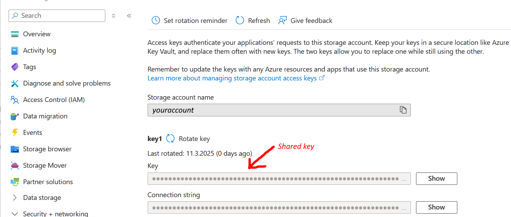

# Demonstrate failure case for fluent-bit issue #9677

See [github issue](https://github.com/fluent/fluent-bit/issues/9677)

To run the demonstration just run

~~~shell
$ docker compose up
~~~

## Description

For using the https access to azurite a self-signed certificate has been added with [mkcert](https://github.com/FiloSottile/mkcert)
The certificate is in file [azurestorage.local.pem](./azurestorage.local.pem) and the key for it is in [azurestorage.local-key.pem](./azurestorage.local-key.pem).

Unfortunately, the demo doesn't crash when using azurite: the emulator simply refuses to create the blob container _access-logs_ and thus avoids the failure mode.

When using a real azure storage account, though, the crash is reproducable with fluent-bit 3.2.x (I tried x=0, 7, 8) where is with fluent-bit-3.1.10 the demo runs without
any trouble.

In order to make the demo crash you need
- an azure account (I'd guess a trial-account would be sufficient)
- a storage account
- The shared access key from the storage account (see picture)

Copy [fluent-bit-sa.sample.yaml](./fluent-bit-sa.sample.yaml) to _fluent-bit-sa.yaml_ and replace the samples for *account_name* and *shared_key* with the values for your storage account.
Finally, change the comments in _docker-compose.yaml_ so that it reads

~~~yaml
services:
  fluent-bit:
    image: cr.fluentbit.io/fluent/fluent-bit:3.2.8
    volumes:
      # comment this line and uncomment the next for a real azure storage acount
      # - ./fluent-bit.yaml:/tmp/fluent-bit.yaml:ro
      - ./fluent-bit-sa.sample:/tmp/fluent-bit.yaml:ro
  # rest omitted ...
~~~
